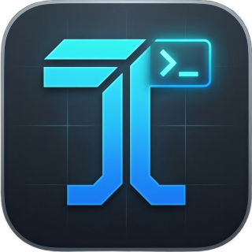
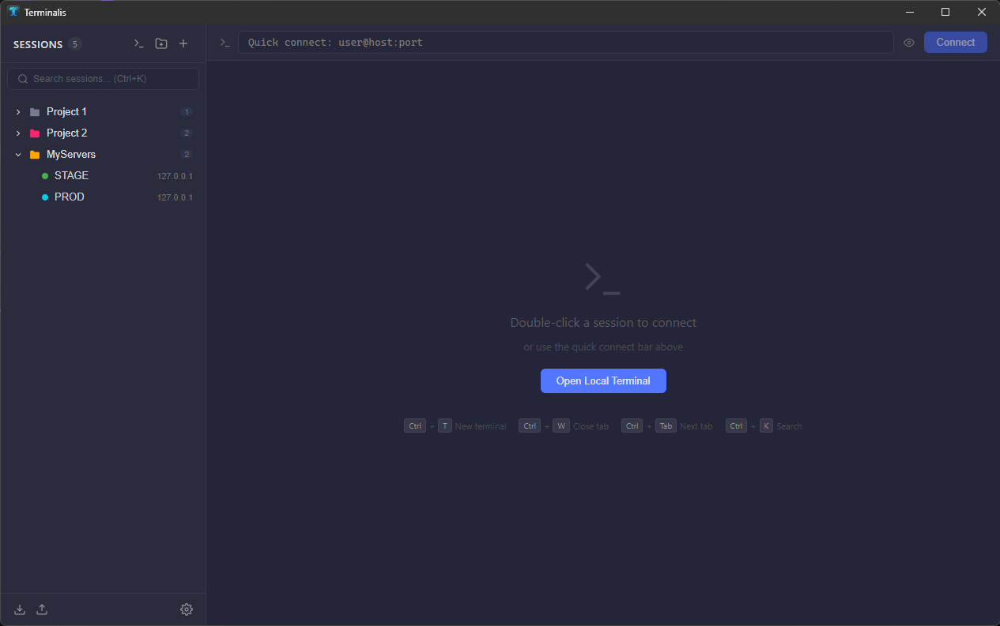
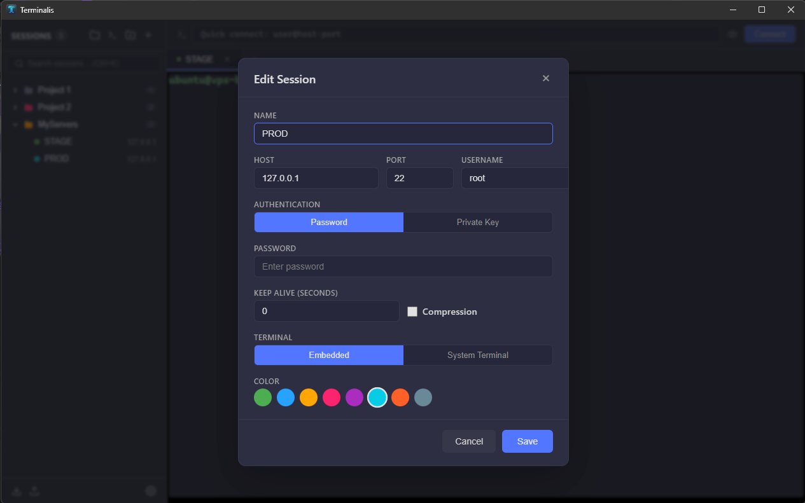
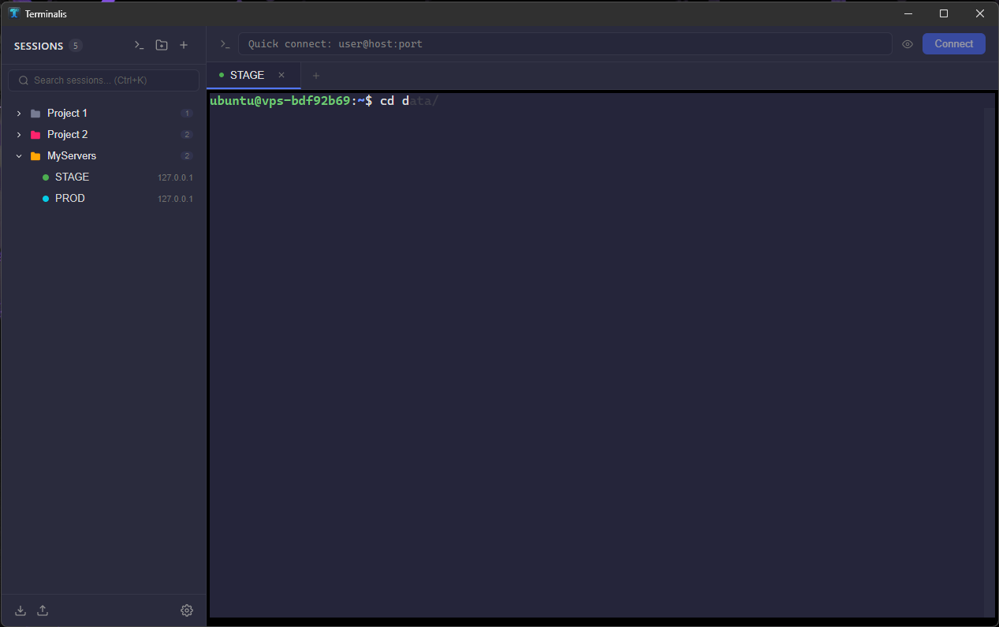

#  Terminalis

A cross-platform SSH session manager and terminal emulator built with Go, Svelte, and xterm.js. Manage your SSH connections, organize them in folders, transfer files, and work with multiple terminal tabs — all from a single native desktop app.

> Heavily vibe coded by **Sabin Petru**.

<p>
  
  
  
</p>

---

## Features

### Session Management
- Create, edit, delete, and duplicate SSH sessions
- Organize sessions into color-coded folders with drag-and-drop
- Quick connect bar — type `user@host:port` and go
- Import/export all sessions and folders as JSON
- Search and filter sessions by name, host, or username
- Right-click context menu for quick actions

### SSH Connections
- Password and private key authentication (RSA, Ed25519, ECDSA)
- Passphrase-protected key support
- Host key verification with fingerprint display (remembered in `~/.terminalis/known_hosts`)
- Configurable port, timeout, keep-alive, and compression
- Multiple concurrent connections via tabs

### Local Terminal
- Open local shell tabs alongside SSH sessions
- Automatic detection of installed shells (bash, zsh, fish, PowerShell, cmd, etc.)
- Full PTY support for interactive sessions

### Terminal Emulator
- Full terminal emulation powered by xterm.js
- 256-color support with customizable theme
- Adjustable font size (10-24px)
- Customizable background color
- 10,000-line scrollback buffer
- Clickable URLs (web link detection)
- Copy on select, right-click paste

### Zsh-style Autosuggestions
- Ghost text suggestions as you type, drawn from:
  1. Local session command history
  2. Remote shell history (bash, zsh, fish)
  3. Remote available commands (`compgen -c` / PATH listing)
- Press **Right Arrow** or **End** to accept a suggestion
- Per-session history stored locally (up to 1,000 commands)
- Up to 5,000 remote history entries fetched on connect

### SFTP File Browser
- Built-in graphical file browser for any SSH session
- Breadcrumb navigation with clickable path segments
- Sort by name, size, or modification time
- Toggle hidden files
- Download files (double-click or drag out)
- Upload files (button, or drag-and-drop onto panel)
- Follow terminal directory option (auto-syncs with `pwd`)

### External Terminal Support
- Launch SSH sessions in your preferred system terminal
- Auto-detects installed terminals:
  - **Windows:** Windows Terminal, PowerShell, CMD, Git Bash
  - **macOS:** Terminal.app, iTerm2, Alacritty, Kitty, WezTerm
  - **Linux:** GNOME Terminal, Konsole, Xfce4-Terminal, Alacritty, Kitty, WezTerm, Tilix, xterm

### Keyboard Shortcuts

| Shortcut | Action |
|---|---|
| `Ctrl+T` | Open new local terminal |
| `Ctrl+W` | Close active tab |
| `Ctrl+Tab` | Next tab |
| `Ctrl+Shift+Tab` | Previous tab |
| `Ctrl+K` | Focus session search |
| `Right Arrow` / `End` | Accept autosuggestion |
| Middle-click tab | Close tab |

### Settings
- Terminal font size and background color
- Default SSH username and port
- Connection timeout
- All preferences saved to `~/.terminalis/config.json`

---

## Data Storage

All data lives in `~/.terminalis/`:

| File | Purpose |
|---|---|
| `sessions.json` | Saved sessions and folders |
| `known_hosts` | SSH host key fingerprints |
| `config.json` | App preferences |
| `history/<id>.json` | Per-session command history |

No database required. All files are human-readable JSON and fully portable.

---

## Building from Source

### Prerequisites
- [Go 1.23+](https://go.dev/dl/)
- [Node.js 18+](https://nodejs.org/)
- [Wails CLI v2](https://wails.io/docs/gettingstarted/installation)

Install the Wails CLI:
```bash
go install github.com/wailsapp/wails/v2/cmd/wails@latest
```

### Windows

Run the included build script:
```
build-windows.bat
```

Or manually:
```
wails build -platform windows/amd64
```

The output binary will be at `build\bin\Terminalis.exe`.

### macOS

Run the included build script:
```bash
chmod +x build-mac.sh
./build-mac.sh
```

Or manually:
```bash
wails build -platform darwin/universal
```

The output app bundle will be at `build/bin/Terminalis.app`.

### Linux

```bash
wails build -platform linux/amd64
```

The output binary will be at `build/bin/Terminalis`.

### Development Mode

For live hot-reload during development:
```bash
wails dev
```

---

## Tech Stack

- **Backend:** Go + `golang.org/x/crypto/ssh` + `github.com/pkg/sftp`
- **Desktop Framework:** [Wails v2](https://wails.io/) (native binaries, no Electron)
- **Frontend:** Svelte + TypeScript
- **Terminal:** xterm.js + fit addon + web-links addon
- **Storage:** JSON files (no database)

---

## Platforms

| Platform | Architecture |
|---|---|
| Windows | amd64 |
| macOS | amd64, arm64 (universal) |
| Linux | amd64 |

---

## License

See [LICENSE](LICENSE) for details.
